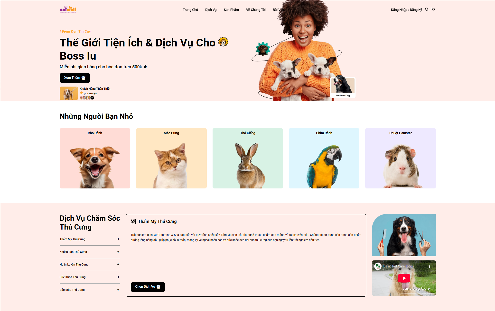

# Animall – Website Bán Đồ & Dịch Vụ Thú Cưng

---

## 1. Tên dự án:

Website bán đồ & dịch vụ cho thú cưng **Animall** (Front-end: HTML/CSS/JavaScript).

---

## 2. Giới thiệu:

Dự án xây dựng một website bán hàng dành cho thú cưng, cho phép người dùng:

- Xem danh mục sản phẩm theo loài: Cún, Mèo, Chim, Thỏ, Hamster.
- Xem chi tiết sản phẩm, giá, hình ảnh.
- Thêm sản phẩm/dịch vụ vào giỏ hàng và thanh toán mô phỏng.
- Theo dõi tin tức/bài viết liên quan đến chăm sóc thú cưng.
- Đăng ký/đăng nhập tài khoản cơ bản (lưu tại `localStorage`).
- Gửi thông tin liên hệ qua form (mô phỏng).

> **Repo front-end (hiện tại):**  
> https://github.com/fleur-en-cristal/animall-website

> **Link demo GitHub Pages (sau khi bật Pages):**  
> `https://fleur-en-cristal.github.io/animall-website/`

---

## 3. Thành viên nhóm:

| STT | MSSV     | Github Username                                         |
|-----|----------|---------------------------------------------------------|
| 1   | 23540027 | [fleur-en-cristal](https://github.com/fleur-en-cristal) |


## 4. Công nghệ sử dụng:

- **Front-end:**
  - HTML5, CSS3 (Flexbox, Grid).
  - JavaScript ES6.
  - Boxicons, Google Fonts (Roboto).

- **Dữ liệu:**
  - Các file JSON tĩnh:
    - `data/products.json` – danh sách sản phẩm.
    - `data/posts.json` – bài viết.
    - `data/users.json` – tài khoản mẫu.
    - `data/services.json` – thông tin dịch vụ.

- **Lưu trữ phía client:**
  - `localStorage`:
    - Lưu giỏ hàng.
    - Lưu thông tin user hiện tại sau khi đăng nhập.
    - Lưu nháp form liên hệ.

- **Công cụ:**
  - VS Code, Live Server.
  - Git & GitHub (quản lý mã nguồn, public repo).
  - GitHub Pages (deploy website tĩnh).

---

## 5. Cấu trúc thư mục chính:

```text
animall-website/
│
├── index.html          # Trang chủ
├── products.html       # Trang danh mục sản phẩm
├── checkout.html       # Trang thanh toán
├── thankyou.html       # Trang cảm ơn sau khi đặt hàng
├── login.html          # Đăng nhập
├── register.html       # Đăng ký
├── posts.html          # Danh sách bài viết
├── contact.html        # Trang liên hệ
│
├── css/
│   ├── style.css       # CSS chung cho toàn bộ website
│   └── checkout.css    # CSS riêng cho trang thanh toán
│
├── js/
│   ├── script.js       # Logic: header, dịch vụ, load sản phẩm, bài viết, search…
│   ├── cart.js         # Xử lý giỏ hàng + drawer giỏ hàng
│   └── checkout.js     # Xử lý trang thanh toán, tính phí ship, mã giảm giá
│
├── data/
│   ├── products.json   # Dữ liệu sản phẩm (chia theo dog/cat/bird/rabbit/hamster)
│   ├── posts.json      # Dữ liệu bài viết
│   ├── services.json   # Dịch vụ chăm sóc thú cưng
│   └── users.json      # User mẫu (demo đăng nhập)
│
└── image/
    ├── ...             # Toàn bộ hình ảnh giao diện, sản phẩm, logo

